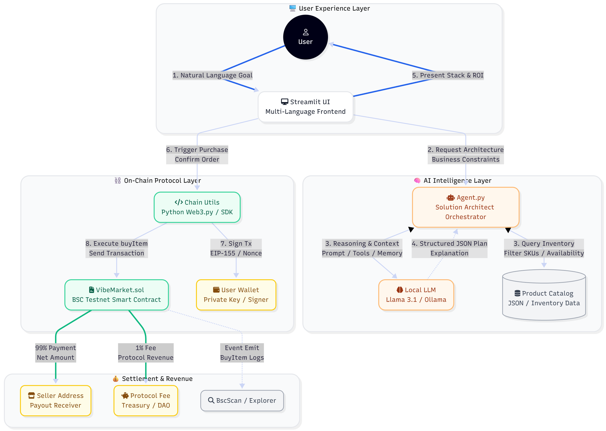

    # VibeBuyer Pro – AI-Native Procurement Protocol for Indie Hackers

    > **VibeBuyer Pro** is an AI-native procurement protocol that automatically assembles and purchases the best stack of digital tools (hosting, DB, LLM credits, marketing, analytics, etc.) for indie hackers and small teams — and settles everything on-chain with a 1% protocol fee.

    Built for the **Seedify Vibecoins** program to showcase:

    - AI-assisted **vibe coding** from idea → code → tests
    - A **working on-chain protocol** (BSC Testnet) with real transactions
    - A minimal but realistic **business story** around protocol fees & digital tool bundles

    ---

    ## Table of Contents

    1. [Problem & Motivation](#problem--motivation)  
    2. [What VibeBuyer Pro Does](#what-vibebuyer-pro-does)  
    3. [Architecture](#architecture)  
    4. [On-Chain Protocol](#on-chain-protocol)  
    5. [AI Stack Architect](#ai-stack-architect)  
    6. [Product Data & Scoring](#product-data--scoring)  
    7. [Vibe Coding & AI-Assisted Development](#vibe-coding--ai-assisted-development)  
    8. [Getting Started](#getting-started)  
    9. [Demo Walkthrough](#demo-walkthrough)  
    10. [Repository Structure](#repository-structure)  
    11. [Roadmap](#roadmap)  
    12. [Team](#team)  
    13. [License](#license)  

    ---

    ## Problem & Motivation

    Indie hackers and small AI builders face the same recurring problem:

    - There are **too many tools** (Vercel, Supabase, OpenAI, Mixpanel, Ahrefs, MailerLite, etc.).
    - Most people just **ask ChatGPT for recommendations**, then manually:
    - compare pricing pages,
    - assemble a stack in Notion,
    - and copy-paste credit cards / wallets across multiple sites.
    - There is **no unified way** to:
    - describe your use case in natural language,
    - get a curated stack,
    - and settle the purchase in one place.

    At the same time, Web3 protocols and launchpads want:

    - **On-chain volume & fees** tied to real use cases, not just speculative trading.
    - Clear, composable **protocol primitives** that others can build on top of.

    ---

    ## What VibeBuyer Pro Does

    VibeBuyer Pro turns this flow into a single protocol + agent:

    1. **You describe your goal in natural language**  
    _“I want to build a SaaS MVP with auth, DB, and analytics on a tight budget.”_

    2. The **AI Stack Architect**:
    - reads a curated catalog of 20+ indie-hacker tools
    - scores them by **vibe_score**, compatibility, and cost
    - chooses a **bundle** (e.g., Vercel + Supabase + OpenAI + Mixpanel)

    3. The app presents a **recommended stack**:
    - Stack name (e.g., “Lean SaaS Starter Kit”)  
    - Selected items and total price in BNB  
    - A short **ROI analysis** explaining why it’s a good combo

    4. With one click, VibeBuyer Pro:
    - sends **on-chain purchases** via a smart contract on BSC Testnet
    - **99%** of the payment goes to the seller
    - **1%** is retained in the protocol contract as a **protocol fee**

    5. Everything is:
    - **Multi-language** UI (EN / ZH / JA)
    - **AI-native** (vibe-coded with LLMs)
    - **On-chain** (verifiable on BscScan)

    ---

    ## Architecture

    High-level architecture:

    1. **Frontend** – Streamlit app (`app.py`)
    - Multi-language UX (English, Chinese, Japanese)
    - Hero metrics, AI Architect panel, recommended stack cards
    - “Buy all” button that triggers on-chain purchases

    2. **AI Backend** – Local LLM Agent (`agent.py`)
    - Uses `llama3.1` via [Ollama](https://ollama.com/) (or another local LLM endpoint)
    - Prompted as a **Solution Architect** / Procurement Agent
    - Outputs a **strict JSON** spec describing the recommended stack

    3. **On-chain Layer** – BSC Testnet (`contracts/VibeMarket.sol`)
    - Minimal `VibeMarket` contract
    - Single entrypoint: `buyItem(address seller, string itemId)`  
    - 1% fee retained in contract, 99% sent to seller
    - `Purchase` event emitted for each item

    4. **Integration Glue** – Python Web3 client (`chain_utils.py`)
    - Reads RPC URL, private key, and wallet from `.env`
    - Deploys the contract (`deploy.py`)
    - Sends on-chain transactions when purchases are triggered

    

    > **Note:** The architecture diagram above is a suggested visual. Feel free to adjust details to match your final deployment and rename `docs/architecture.png` if needed.

    ---

    ## On-Chain Protocol

    ### Contract: `VibeMarket.sol`

    Key properties:

    - Chain: **BSC Testnet** (chainId = 97)  
    - Language: **Solidity 0.8.x**  
    - SPDX: **MIT**

    Core logic (simplified):

    ```solidity
    // SPDX-License-Identifier: MIT
    pragma solidity ^0.8.0;

    contract VibeMarket {
        address public owner;
        uint256 public feePercentage = 1; // 1% protocol fee

        event Purchase(
            address indexed buyer,
            address indexed seller,
            uint256 amount,
            uint256 fee,
            string itemId
        );

        constructor() {
            owner = msg.sender;
        }

        function buyItem(address payable seller, string memory itemId) external payable {
            require(msg.value > 0, "Price must be > 0");
            require(seller != address(0), "Invalid seller address");

            uint256 fee = (msg.value * feePercentage) / 100;
            uint256 sellerAmount = msg.value - fee;

            seller.transfer(sellerAmount);

            // 1% fee stays in the contract (can later be withdrawn by owner or used for protocol logic)
            emit Purchase(msg.sender, seller, msg.value, fee, itemId);
        }

        function withdrawFees() external {
            require(msg.sender == owner, "Only owner");
            payable(owner).transfer(address(this).balance);
        }
    }

    The Streamlit app uses `chain_utils.py` to:

    - Load the deployed contract (`contract_config.json`)
    - Build and sign transactions with Web3.py
    - Send purchases for each selected item in the stack

    ---

    ## AI Stack Architect

    The AI agent lives in `agent.py` and is designed as a **Solution Architect** / Procurement Agent:

    - Input:
    - Natural language requirement
    - Language code (`en`, `zh`, `ja`)
    - A structured list of products (loaded from `data/products_*.json`)

    - Output (JSON only):

    ```json
    {
    "thought_process": "Short, high-level reasoning explaining the user's goal and constraints.",
    "stack_name": "Lean SaaS Starter Kit",
    "selected_ids": [1, 9, 19],
    "roi_analysis": "Why this stack provides the best ROI for the budget / goal.",
    "total_vibe_score": 27.9
    }
    The prompt explicitly asks the model to:

    - Respect the available product list (`id`, `price`, `vibe_score`, `ecosystem`, `monthly_cost`)
    - Stay under a reasonable budget (implicitly derived from the product prices)
    - Prefer high-ROI, high-vibe stacks instead of random combinations
    - Answer in the correct language (English, Chinese, or Japanese) for `thought_process` and `roi_analysis`

    The Streamlit UI then:

    - Shows the Architect’s Note (`thought_process`)
    - Displays the recommended stack name (`stack_name`)
    - Renders one card per selected product
    - Allows the user to purchase the entire stack in one flow (`selected_ids`)

    ---

    ## Product Data & Scoring

    The product catalog lives under `data/`:

    - `data/products_en.json`
    - `data/products_zh.json`
    - `data/products_ja.json`

    Each entry follows a structured schema, for example:

        {
        "id": 1,
        "name": "Vercel Pro Deployment Credits",
        "price": 0.020,
        "category": "DevTools",
        "description": "Hosted deployments for your Next.js or React apps with global edge caching and one-click rollbacks.",
        "tags": ["hosting", "nextjs", "frontend", "deploy", "serverless"],
        "vibe_score": 9.8,
        "ecosystem": ["React", "Next.js", "Node.js", "Frontend"],
        "monthly_cost": 20
        }

    Chinese and Japanese files:

    - Preserve the same `id` and `price`
    - Translate `name`, `category`, and `description`
    - Optionally localize tags and ecosystem-related wording

    This design allows the AI agent to reason over:

    - Cost (one-time `price` and indicative `monthly_cost`)
    - Ecosystem compatibility (e.g., React + Next.js + Supabase)
    - Perceived “vibe” and usefulness for indie hackers (`vibe_score`)

    ---

    ## Vibe Coding & AI-Assisted Development

    This project intentionally embraces **vibe coding** and AI-assisted workflows.

    Many parts of the system were:

    - Drafted with LLM help (prompts, UI skeletons, JSON schemas)
    - Then reviewed, edited, and wired together manually

    To make this transparent, the repository can include an `ai_logs/` folder:

    - `ai_logs/prompts_agent.md` – evolution of the AI Architect prompt  
    - `ai_logs/prompts_ui.md` – prompts used for UI and UX copy  
    - `ai_logs/prompts_contract.md` – prompts used to scaffold the Solidity contract

    This highlights how Seedify Vibecoins’ **“build with AI”** ethos is applied in practice:

    - AI as a collaborator in architecture and implementation
    - Human as the final editor and integrator

    ---

    ## Getting Started

    ### 1. Requirements

    - Python 3.10+
    - A local LLM endpoint (e.g., [Ollama](https://ollama.com/) with `llama3.1`)
    - Access to a BSC Testnet RPC endpoint
    - `pip` and virtualenv (recommended)

    ### 2. Clone the repository

        git clone https://github.com/your-org/vibebuyer-pro.git
        cd vibebuyer-pro

    ### 3. Set up a virtual environment and install dependencies

        python -m venv .venv
        source .venv/bin/activate    # On Windows: .venv\Scripts\activate

        pip install -r requirements.txt

    Make sure `requirements.txt` includes, at minimum:

    - `streamlit`
    - `web3`
    - `python-dotenv`
    - `requests`
    - `py-solc-x` (or a compatible Solidity compiler helper)

    ### 4. Configure environment variables

    Create a `.env` file in the project root:

        RPC_URL=https://data-seed-prebsc-1-s1.binance.org:8545/
        WALLET_ADDRESS=0xYourTestnetWalletAddress
        PRIVATE_KEY=0xyour_private_key_for_testing_only
        OLLAMA_HOST=http://localhost:11434
        OLLAMA_MODEL=llama3.1

    Security notes:

    - Use **testnet-only** keys and addresses.
    - Do not commit `.env` to version control.

    ### 5. Deploy the smart contract

    Deploy the `VibeMarket` contract to BSC Testnet:

        python deploy.py

    This script will:

    - Compile `contracts/VibeMarket.sol`
    - Send a deployment transaction from `WALLET_ADDRESS`
    - Wait for confirmation
    - Write `contract_config.json` with:

        {
        "address": "0xDeployedContractAddress",
        "abi": [ ... ]
        }

    ### 6. Run the Streamlit app

    Start the frontend:

        streamlit run app.py

    Then open the URL shown in the terminal, for example:

    - `http://localhost:8501`

    ---

    ## Demo Walkthrough

    This is the suggested demo flow for judges and users.

    1. **Select a language**  
    Use the sidebar to choose between English, Chinese, and Japanese.  
    The hero text, button labels, and AI explanations will switch accordingly.

    2. **Check wallet status**  
    In the sidebar, confirm that the app shows:

    - “Connected” for the blockchain connection
    - The current BNB testnet balance for the configured wallet

    3. **Describe your build**  
    In the main hero section, type a free-form requirement, for example:

    - “I want to build a SaaS MVP with auth, DB, and analytics on a tight budget.”
    - “I want to launch an AI assistant with a landing page and email capture.”

    Click the primary button (e.g., “Generate Stack ⚡”).

    4. **Inspect the AI Architect panel**  

    The Architect panel shows:

    - A short “Architect’s Note” explaining how the stack was chosen
    - A “Target ROI” summary derived from the `roi_analysis`

    5. **Review the recommended stack**  

    Below the AI panel, you will see a set of product cards representing the recommended stack:

    - Each card includes:
        - Name
        - Short description
        - Price in BNB
        - A “Vibe Score” badge

    The stack title (for example “Lean SaaS Starter Kit”) summarizes the bundle.

    6. **One-click on-chain purchase**  

    Click the “Purchase All (X.XXXX BNB)” button:

    - A progress bar indicates that the protocol is acquiring each item.
    - For each selected product ID, the app calls `buy_item_on_chain`.
    - A transaction is sent to the `VibeMarket` contract on BSC Testnet.

    On success, the UI will:

    - Show a success message (e.g., “Transaction Complete!”)
    - Display one or more BscScan links so the judge can verify the on-chain activity.

    7. **Explore the broader ecosystem**  

    Scroll down to the “Explore Ecosystem” section:

    - Browse the curated tool catalog by category, price, and vibe.
    - Extend this section as needed to include per-item purchase or richer filters.

    ---

    ## Repository Structure

    A suggested structure for the project:

        .
        ├── app.py                    # Streamlit frontend (multi-language UI)
        ├── agent.py                  # AI Stack Architect logic (LLM integration)
        ├── chain_utils.py            # Web3 integration and on-chain purchase helper
        ├── deploy.py                 # Smart contract deployment script
        ├── contracts/
        │   └── VibeMarket.sol        # Minimal purchase protocol with 1% protocol fee
        ├── data/
        │   ├── products_en.json      # English product catalog
        │   ├── products_zh.json      # Chinese product catalog
        │   └── products_ja.json      # Japanese product catalog
        ├── ai_logs/
        │   ├── prompts_agent.md      # Prompts used to create and refine the AI Architect
        │   ├── prompts_ui.md         # Prompts and snippets for the UI
        │   └── prompts_contract.md   # Prompts used to scaffold the Solidity contract
        ├── docs/
        │   ├── architecture.png      # High-level architecture diagram
        │   ├── home.png              # Screenshot of the main UI
        │   ├── stack.png             # Screenshot of the recommended stack view
        │   └── tx.png                # Screenshot of a BscScan transaction
        ├── contract_config.json      # Generated: deployed contract address + ABI
        ├── requirements.txt          # Python dependencies
        ├── style.css                 # Optional: additional styling for the Streamlit app
        └── README.md                 # This file

    You can adjust the exact structure as your implementation evolves.

    ---

    ## Roadmap

    Short-term improvements:

    - **Explicit budget handling**  
    Allow the user to specify a budget (in BNB or USD), and let the AI Architect optimize the stack under that constraint.

    - **Per-product sellers**  
    Let each product be associated with a different seller address to simulate a real marketplace of multiple providers.

    - **Deeper stack analysis**  
    Provide more detailed breakdowns:
    - Estimated monthly cost
    - Risk profile (e.g., vendor lock-in, overkill for MVP)
    - Alternative “lean” vs. “premium” stack suggestions

    Mid-term roadmap:

    - **Composable protocol**  
    Turn VibeBuyer Pro into a protocol that other frontends and agents can integrate with:
    - Any curated catalog can plug into the AI Architect.
    - The on-chain layer remains the canonical record of purchases and protocol fees.

    - **Token and incentive layer**  
    Experiment with a fee token or points system:
    - Share protocol fees with integrators and early adopters.
    - Reward high-quality catalog curation and on-chain volume.

    - **Deeper launchpad integration**  
    Integrate with launchpads like Seedify:
    - Use VibeBuyer stacks as a default “infrastructure basket” for new projects.
    - Offer milestone-based unlocks funded by protocol fees or partner programs.

    ---

    ## Team

    **Solo builder**, ECE background and AI-focused PhD track:

    - Experience in building end-to-end ML and LLM systems
    - Comfortable in Python, C++, and Web3 tooling
    - Focused on pragmatic, indie-hacker friendly tools

    Motivation for building VibeBuyer Pro:

    - Show that **AI + Web3** can be applied to very practical workflows (tool procurement), not just trading.
    - Demonstrate how vibe coding and AI assistance can meaningfully reduce time-to-prototype for serious, on-chain products.

    Open to collaboration with:

    - Designers interested in pushing the UX beyond Streamlit
    - Web3 protocols and launchpads who want to integrate an AI-native procurement primitive
    - Other indie hackers who want to expand the catalog or add new chains

    ---

    ## License

    This project is licensed under the **MIT License**.

    You are free to:

    - Use it as a starting point for your own AI + Web3 experiments
    - Fork and adapt it for other hackathons
    - Extend it into a production-grade protocol if you see enough demand
